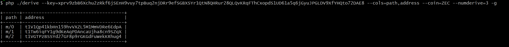
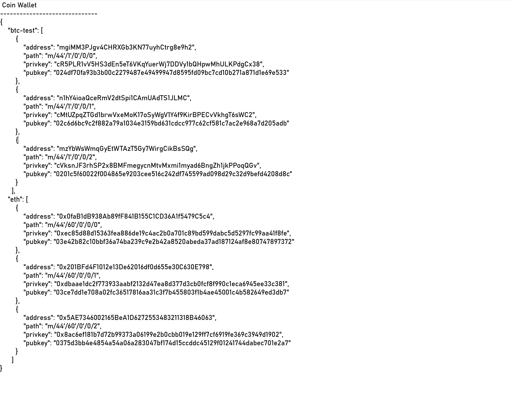
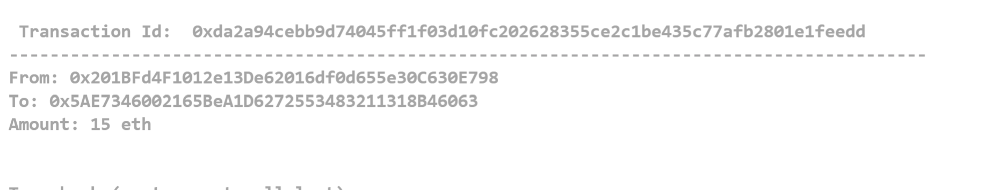
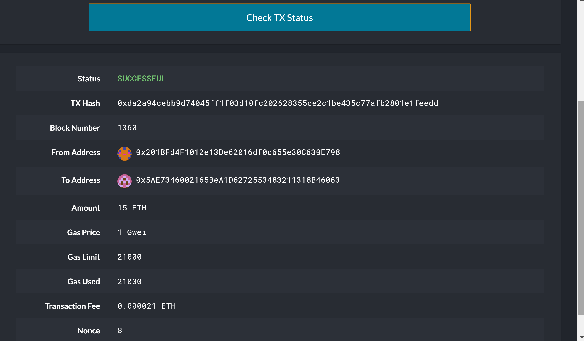
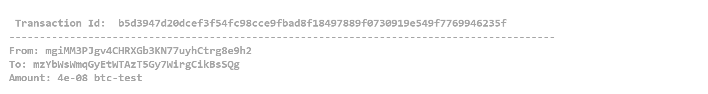
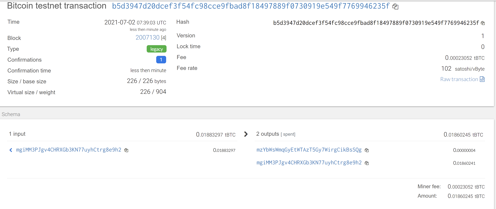

# Multi-Blockchain Wallet in Python

## Description
A universal wallet to manage two coins, Ether and BTC testnet. This wallet uses HD_Wallet to derive a list of ETH and BTCTEST wallets addresses/child private/public key pair based upon the mnemonic phrase/seed phase stored in .env file. 

The addresses derived for both BTCTESTNET and ETH, were prefunded, BTCTESTNET via the bit coin faucet and ETH via ganache.

Both ether and btc coins can be sent between the addresses generated or to any other valid address. For the purpose of testing, the token was sent from the first/second address to the third address in the coin list of that particular coin.  

Using those addresses, ether token can be sent over the POA ethernet network running locally on the machine or btc testnet tokens send using bit library.

## Files & Folder
## Files
- wallet.py : File containing the code of the universal wallet.
- constants.py : file defines the constants.
- test_wallet.py : console application to test the wallet, by generating wallets, and sending transactions.
- requirements.txt: file containing instructions to install bit, web3 and HD Wallet.

## Folders
- hd-wallet-derive : clone of hd-wallet.
- images : contains images of screenshots for README.md.

## Assumptions:
- an .env file with the mnemonic is located in the same folder. 
- At least one account for both ETH and BTCTEST accounts generated mnemonic by the  have been prefunded with ether and btc. For eth, the 2nd address is used to send funds as it has been prefunded, for btc, the first address in the wallet has the most funds, so that is used for testing.

## Prerequisites
- PHP installed.
- PoA ethernet network setup.

## Dependencies

- [`bit`](https://ofek.github.io/bit/) Python Bitcoin library installed.
- [`web3.py`](https://github.com/ethereum/web3.py) Python Ethereum library installed.

See [requirements.txt](requirements.txt) for steps to install the dependencies before setting up the project.

## Project Setup
1. Created a Folder named Wallet in the root homework folder
2. Cloned HD Wallet
    - Clone the [HD Wallet Derive](Resources/HD_Wallet_Derive_Install_Guide.md) 
    - Create a symlink called `derive` for the `hd-wallet-derive/hd-wallet-derive.php` script. This will clean up the command needed to run the script in our code, as we can call `./derive` instead of `./hd-wallet-derive/hd-wallet-derive.php`: 
        - Open up Git-Bash as an administrator (right-click on Git-Bash in the start menu).
        - Within `bash`, run the command `export MSYS=winsymlinks:nativestrict`.
        - Run the following command: `ln -s hd-wallet-derive/hd-wallet-derive.php derive`. 
        - Test that you can run the `./derive` script properly, by running the following command.  
         >> 
              php ./derive --key=xprv9zbB6Xchu2zRkf6jSEnH9vuy7tpBuq2njDRr9efSGBXSYr1QtN8QHRur28QLQvKRqFThCxopdS1UD61a5q6jGyuJPGLDV9XfYHQto72DAE8 --cols=path,address --coin=ZEC --numderive=3 -g

        

 2 - Run the PoA ethernet network. My old network kept crashing , so setup a new network for this homework, did not follow steps to replace the address in genesis block json file. 
    - When the nodes were ran, got the error "{'code': -32000, 'message': 'only replay-protected (EIP-155) transactions allowed over RPC'", to overcome this had to add the add the following flags while running the nodes for mining  --rpc.allow-unprotected-txs.
    >>

    ./geth --datadir ./peter/node1 --unlock "c0f179b0a6c35369c371100c93344332134092e1" --mine --http   --password ./peter/password1.txt --allow-insecure-unlock   --rpc.allow-unprotected-txs

# How to use the wallet

To Test the wallet, run the test_wallet.py, a console app.

## Derive the wallets from seed phrase
First the child wallets are derived using HD Wallet, using a mnemonic phase stored in the .env file
    >>

    # Derive the wallets for ETH, using the mnemonic phase
    coins[ETH] = derive_wallets(mnemonic, ETH)

    # Derive the wallets for BTCTEST, using the mnemonic phase
    coins[BTCTEST] = derive_wallets(mnemonic, BTCTEST)

    # Print the wallets
    print(f"\033[1m Coin Wallet \033[0m")
    print('-'*30)
    print(json.dumps(coins, indent=4, sort_keys=True))
    print()

The result of this is as follows

## Test Transaction

### **Ethernet TestNet**:
For testing, the POA ethernet has been setup and running on the local machine. MyCrypto Wallet has been connected to this network. 

>>
    #amount to send in ether
        # Create a ethernet testnet account from the private key
    # Send ETH from account to the 3rd Address in the wallet
    # print the last transaction id, that is supposedly the current
    
    # amount to send in ether
    eth_amount = 15

    # create the account from the private key from the second address in the wallet
    eth_account = priv_key_to_account(ETH, coins[ETH][1]['privkey'] ) 
    
    # set the address of the recipient, setting it to the 3rd address in the wallet
    eth_recipient = coins[ETH][2]['address']
    
    # send the transaction of eth_amount from the account to the recipient 
    result = send_tx(ETH, eth_account, eth_recipient, eth_amount)

Verified the transaction in MyCrypto

### **Bitcoin Testnet**
To BTC testnet token was tested using the [block explorer](https://tbtc.bitaps.com/) to watch transactions on the address.

>> 
    # amount of btc to send 
    btc_amount = 0.00000004

    # create a BTC account from the private key of the first address in the wallet
    btc_test_account = priv_key_to_account(BTCTEST, coins[BTCTEST][0]['privkey'] ) 

    # set the address of the recipient, setting it to the 3rd address in the wallet
    btc_recipient = coins[BTCTEST][2]['address']
    
    # send the transaction of eth_amount from the account to the recipient 
    result = send_tx(BTCTEST, btc_test_account, btc_recipient , btc_amount)

- Used the [block explorer](https://tbtc.bitaps.com/) to watch transactions on the address address of the sender and clicked on the latest transaction.

    

